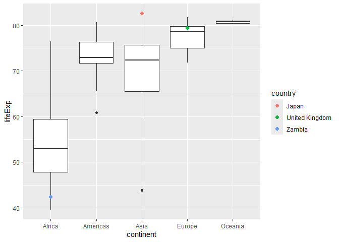
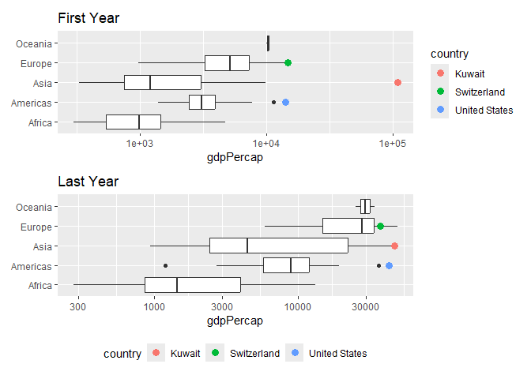
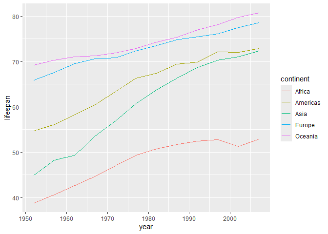

Gapminder
================
Cooper Penkava
2025-03-02

- [Grading Rubric](#grading-rubric)
  - [Individual](#individual)
  - [Submission](#submission)
- [Guided EDA](#guided-eda)
  - [**q0** Perform your “first checks” on the dataset. What variables
    are in
    this](#q0-perform-your-first-checks-on-the-dataset-what-variables-are-in-this)
  - [**q1** Determine the most and least recent years in the `gapminder`
    dataset.](#q1-determine-the-most-and-least-recent-years-in-the-gapminder-dataset)
  - [**q2** Filter on years matching `year_min`, and make a plot of the
    GDP per capita against continent. Choose an appropriate `geom_` to
    visualize the data. What observations can you
    make?](#q2-filter-on-years-matching-year_min-and-make-a-plot-of-the-gdp-per-capita-against-continent-choose-an-appropriate-geom_-to-visualize-the-data-what-observations-can-you-make)
  - [**q3** You should have found *at least* three outliers in q2 (but
    possibly many more!). Identify those outliers (figure out which
    countries they
    are).](#q3-you-should-have-found-at-least-three-outliers-in-q2-but-possibly-many-more-identify-those-outliers-figure-out-which-countries-they-are)
  - [**q4** Create a plot similar to yours from q2 studying both
    `year_min` and `year_max`. Find a way to highlight the outliers from
    q3 on your plot *in a way that lets you identify which country is
    which*. Compare the patterns between `year_min` and
    `year_max`.](#q4-create-a-plot-similar-to-yours-from-q2-studying-both-year_min-and-year_max-find-a-way-to-highlight-the-outliers-from-q3-on-your-plot-in-a-way-that-lets-you-identify-which-country-is-which-compare-the-patterns-between-year_min-and-year_max)
- [Your Own EDA](#your-own-eda)
  - [**q5** Create *at least* three new figures below. With each figure,
    try to pose new questions about the
    data.](#q5-create-at-least-three-new-figures-below-with-each-figure-try-to-pose-new-questions-about-the-data)

*Purpose*: Learning to do EDA well takes practice! In this challenge
you’ll further practice EDA by first completing a guided exploration,
then by conducting your own investigation. This challenge will also give
you a chance to use the wide variety of visual tools we’ve been
learning.

<!-- include-rubric -->

# Grading Rubric

<!-- -------------------------------------------------- -->

Unlike exercises, **challenges will be graded**. The following rubrics
define how you will be graded, both on an individual and team basis.

## Individual

<!-- ------------------------- -->

| Category | Needs Improvement | Satisfactory |
|----|----|----|
| Effort | Some task **q**’s left unattempted | All task **q**’s attempted |
| Observed | Did not document observations, or observations incorrect | Documented correct observations based on analysis |
| Supported | Some observations not clearly supported by analysis | All observations clearly supported by analysis (table, graph, etc.) |
| Assessed | Observations include claims not supported by the data, or reflect a level of certainty not warranted by the data | Observations are appropriately qualified by the quality & relevance of the data and (in)conclusiveness of the support |
| Specified | Uses the phrase “more data are necessary” without clarification | Any statement that “more data are necessary” specifies which *specific* data are needed to answer what *specific* question |
| Code Styled | Violations of the [style guide](https://style.tidyverse.org/) hinder readability | Code sufficiently close to the [style guide](https://style.tidyverse.org/) |

## Submission

<!-- ------------------------- -->

Make sure to commit both the challenge report (`report.md` file) and
supporting files (`report_files/` folder) when you are done! Then submit
a link to Canvas. **Your Challenge submission is not complete without
all files uploaded to GitHub.**

``` r
library(tidyverse)
```

    ## ── Attaching core tidyverse packages ──────────────────────── tidyverse 2.0.0 ──
    ## ✔ dplyr     1.1.4     ✔ readr     2.1.5
    ## ✔ forcats   1.0.0     ✔ stringr   1.5.1
    ## ✔ ggplot2   3.5.1     ✔ tibble    3.2.1
    ## ✔ lubridate 1.9.4     ✔ tidyr     1.3.1
    ## ✔ purrr     1.0.2     
    ## ── Conflicts ────────────────────────────────────────── tidyverse_conflicts() ──
    ## ✖ dplyr::filter() masks stats::filter()
    ## ✖ dplyr::lag()    masks stats::lag()
    ## ℹ Use the conflicted package (<http://conflicted.r-lib.org/>) to force all conflicts to become errors

``` r
library(gapminder)
library(patchwork)
```

    ## Warning: package 'patchwork' was built under R version 4.4.3

*Background*: [Gapminder](https://www.gapminder.org/about-gapminder/) is
an independent organization that seeks to educate people about the state
of the world. They seek to counteract the worldview constructed by a
hype-driven media cycle, and promote a “fact-based worldview” by
focusing on data. The dataset we’ll study in this challenge is from
Gapminder.

# Guided EDA

<!-- -------------------------------------------------- -->

First, we’ll go through a round of *guided EDA*. Try to pay attention to
the high-level process we’re going through—after this guided round
you’ll be responsible for doing another cycle of EDA on your own!

### **q0** Perform your “first checks” on the dataset. What variables are in this

dataset?

``` r
## TASK: Do your "first checks" here!
glimpse(gapminder)
```

    ## Rows: 1,704
    ## Columns: 6
    ## $ country   <fct> "Afghanistan", "Afghanistan", "Afghanistan", "Afghanistan", …
    ## $ continent <fct> Asia, Asia, Asia, Asia, Asia, Asia, Asia, Asia, Asia, Asia, …
    ## $ year      <int> 1952, 1957, 1962, 1967, 1972, 1977, 1982, 1987, 1992, 1997, …
    ## $ lifeExp   <dbl> 28.801, 30.332, 31.997, 34.020, 36.088, 38.438, 39.854, 40.8…
    ## $ pop       <int> 8425333, 9240934, 10267083, 11537966, 13079460, 14880372, 12…
    ## $ gdpPercap <dbl> 779.4453, 820.8530, 853.1007, 836.1971, 739.9811, 786.1134, …

**Observations**:

Looks like these are the following variables:

- Country

- Continent

- Year

- Life Expectancy

- Population

- GDP per Capita

### **q1** Determine the most and least recent years in the `gapminder` dataset.

*Hint*: Use the `pull()` function to get a vector out of a tibble.
(Rather than the `$` notation of base R.)

``` r
## TASK: Find the largest and smallest values of `year` in `gapminder`
year_max <- 
  gapminder %>% 
  pull(year) %>% 
  max()
year_min <- 
  gapminder %>% 
  pull(year) %>% 
  min()
year_max
```

    ## [1] 2007

``` r
year_min
```

    ## [1] 1952

Use the following test to check your work.

``` r
## NOTE: No need to change this
assertthat::assert_that(year_max %% 7 == 5)
```

    ## [1] TRUE

``` r
assertthat::assert_that(year_max %% 3 == 0)
```

    ## [1] TRUE

``` r
assertthat::assert_that(year_min %% 7 == 6)
```

    ## [1] TRUE

``` r
assertthat::assert_that(year_min %% 3 == 2)
```

    ## [1] TRUE

``` r
if (is_tibble(year_max)) {
  print("year_max is a tibble; try using `pull()` to get a vector")
  assertthat::assert_that(False)
}

print("Nice!")
```

    ## [1] "Nice!"

### **q2** Filter on years matching `year_min`, and make a plot of the GDP per capita against continent. Choose an appropriate `geom_` to visualize the data. What observations can you make?

You may encounter difficulties in visualizing these data; if so document
your challenges and attempt to produce the most informative visual you
can.

``` r
## TASK: Create a visual of gdpPercap vs continent
first_year <-
  gapminder %>%
  filter(year == year_min)
first_year %>% 
  ggplot(aes(gdpPercap, continent)) +
  geom_col()
```

<!-- -->

``` r
highest_gdp <- first_year %>% 
  filter(gdpPercap == max(gdpPercap))
first_year %>% 
  ggplot(aes(x = gdpPercap, y = "")) +
  geom_boxplot() +
  geom_text(
    data = highest_gdp,
    aes(label = country),
    nudge_y = 0.1,         
    size = 3.5,
    color = "red"         
  ) +
  scale_x_log10() +
  labs(y = NULL)
```

<!-- -->

**Observations**:

- Kuwait (I think) has a really high gdp per capita. I wonder why they
  produce so much money compared to the size of their population?
- there are a lot more countries that I realized… I thought it was like
  100, but I looked it up and there are 193
  - This bears the question - what about countries that come and go? I
    don’t see the USSR and I do see the Czech republic, both of which
    contradict the state of the world in the 1950s. At what point do you
    contradict reality to make your data tidier?
- I created a second plot to find outliers - a box plot identifies quite
  a few outliers

**Difficulties & Approaches**:

- Initially did a basic bar chart but you absolutely couldn’t read any
  country names
- thought about it, couldn’t think of another way to plot qualitative
  and quantitative data
- remembered that you plot a bar chart sideways, so i tried that
- this was only slightly better
- also, one country (can’t read it) is wayyyyyyyy higher than every
  other one
- changing the width did not help
- tried scale x discrete and scale y discrete
- scale y discrete makes it at least readable

**For Resubmission:**

- I changed it to be continents against gdp per capita (I read that
  wrong the first time)

- I also changed the boxplot to actually call out the outlier, and put
  it on a log scale to see better whats going on

### **q3** You should have found *at least* three outliers in q2 (but possibly many more!). Identify those outliers (figure out which countries they are).

``` r
## TASK: Identify the outliers from q2
cutoff <-
  first_year %>%
  pull(gdpPercap) %>% 
  quantile(prob = .75)
outlier_data <-
  first_year %>% 
  filter(gdpPercap > cutoff)
outlier_countries <-
  outlier_data %>% 
  select(country)
outlier_countries
```

    ## # A tibble: 36 × 1
    ##    country       
    ##    <fct>         
    ##  1 Argentina     
    ##  2 Australia     
    ##  3 Austria       
    ##  4 Bahrain       
    ##  5 Belgium       
    ##  6 Canada        
    ##  7 Chile         
    ##  8 Cuba          
    ##  9 Czech Republic
    ## 10 Denmark       
    ## # ℹ 26 more rows

**Observations**:

- Identify the outlier countries from q2
  - If we are considering all of the points that are outside the box
    plot’s whiskers to be outliers (as maybe implied by the wording of
    “possibly many more”) then the following are outlier countries.

    |                |     |     |     |     |
    |:---------------|-----|-----|-----|-----|
    | Argentina      |     |     |     |     |
    | Australia      |     |     |     |     |
    | Austria        |     |     |     |     |
    | Bahrain        |     |     |     |     |
    | Belgium        |     |     |     |     |
    | Canada         |     |     |     |     |
    | Chile          |     |     |     |     |
    | Cuba           |     |     |     |     |
    | Czech Republic |     |     |     |     |
    | Denmark        |     |     |     |     |

    |         |     |     |     |     |
    |:--------|-----|-----|-----|-----|
    | Finland |     |     |     |     |
    | France  |     |     |     |     |
    | Gabon   |     |     |     |     |
    | Germany |     |     |     |     |
    | Hungary |     |     |     |     |
    | Iceland |     |     |     |     |
    | Iraq    |     |     |     |     |
    | Ireland |     |     |     |     |
    | Israel  |     |     |     |     |
    | Italy   |     |     |     |     |

|                 |     |     |     |     |
|:----------------|-----|-----|-----|-----|
| Kuwait          |     |     |     |     |
| Lebanon         |     |     |     |     |
| Netherlands     |     |     |     |     |
| New Zealand     |     |     |     |     |
| Norway          |     |     |     |     |
| Poland          |     |     |     |     |
| Saudi Arabia    |     |     |     |     |
| Slovak Republic |     |     |     |     |
| Slovenia        |     |     |     |     |
| South Africa    |     |     |     |     |

|                |     |     |     |     |
|:---------------|-----|-----|-----|-----|
| Sweden         |     |     |     |     |
| Switzerland    |     |     |     |     |
| United Kingdom |     |     |     |     |
| United States  |     |     |     |     |
| Uruguay        |     |     |     |     |
| Venezuela      |     |     |     |     |

- But to be honest, that’s a lot of outliers, so I think I will stick to
  the top three - the one huge one and the two in the sort up second
  uppermost grouping

``` r
## TASK: Identify the outliers from q2
cutoff <-
  first_year %>%
  pull(gdpPercap) %>% 
  quantile(prob = 190/193) ##top 3 -> (193-3)/193
outlier_data <-
  first_year %>% 
  filter(gdpPercap > cutoff)
outlier_countries <-
  outlier_data %>% 
  select(country)
outlier_countries
```

    ## # A tibble: 3 × 1
    ##   country      
    ##   <fct>        
    ## 1 Kuwait       
    ## 2 Switzerland  
    ## 3 United States

- Now, our outliers become Kuwait, Switzerland, and the United States

*Hint*: For the next task, it’s helpful to know a ggplot trick we’ll
learn in an upcoming exercise: You can use the `data` argument inside
any `geom_*` to modify the data that will be plotted *by that geom
only*. For instance, you can use this trick to filter a set of points to
label:

``` r
## NOTE: No need to edit, use ideas from this in q4 below
gapminder %>%
  filter(year == max(year)) %>%

  ggplot(aes(continent, lifeExp)) +
  geom_boxplot() +
  geom_point(
    data = . %>% filter(country %in% c("United Kingdom", "Japan", "Zambia")),
    mapping = aes(color = country),
    size = 2
  )
```

<!-- -->

### **q4** Create a plot similar to yours from q2 studying both `year_min` and `year_max`. Find a way to highlight the outliers from q3 on your plot *in a way that lets you identify which country is which*. Compare the patterns between `year_min` and `year_max`.

*Hint*: We’ve learned a lot of different ways to show multiple
variables; think about using different aesthetics or facets.

``` r
## TASK: Create a visual of gdpPercap vs continent


first_year <-
  gapminder %>%
  filter(year == year_min)
last_year <-
  gapminder %>%
  filter(year == year_max)
first_outliers <- first_year %>% 
  filter(country %in% c("Switzerland", "United States", "Kuwait"))
last_outliers <- last_year %>% 
  filter(country %in% c("Switzerland", "United States", "Kuwait"))

plot_first <- first_year %>% 
  ggplot(aes(x = gdpPercap, y = continent)) +
  geom_boxplot() +
  geom_point(
    data = first_outliers,
    aes(color = country),
    size = 3
  ) +
  scale_x_log10() +
  labs(y = NULL, title = "First Year")
  theme(legend.position = "bottom")
```

    ## List of 1
    ##  $ legend.position: chr "bottom"
    ##  - attr(*, "class")= chr [1:2] "theme" "gg"
    ##  - attr(*, "complete")= logi FALSE
    ##  - attr(*, "validate")= logi TRUE

``` r
plot_last <- last_year %>% 
  ggplot(aes(x = gdpPercap, y = continent)) +
  geom_boxplot() +
  geom_point(
    data = last_outliers,
    aes(color = country),
    size = 3
  ) +
  scale_x_log10() +
  labs(y = NULL, title = "Last Year") +
  theme(legend.position = "bottom")

plot_first / plot_last
```

<!-- -->

**Observations**:

- This makes the top 3 outliers much clearer - before I needed to make
  the box plot to figure out those top three that the question not so
  subtly hinted at.
- I still haven’t for the life of me figured out the hella countries
  problem, but the fill at least lets you know the outlier countries.

**For Resubmission**

- loaded patchwork library so that I didn’t have to combine them into
  one dataframe, then put them together and identified the outlier
  countries on both boxplots

- put them into boxplots together

- scaled x on log axis

# Your Own EDA

<!-- -------------------------------------------------- -->

Now it’s your turn! We just went through guided EDA considering the GDP
per capita at two time points. You can continue looking at outliers,
consider different years, repeat the exercise with `lifeExp`, consider
the relationship between variables, or something else entirely.

### **q5** Create *at least* three new figures below. With each figure, try to pose new questions about the data.

``` r
## TASK: Your first graph
gapminder %>% 
  group_by(continent, year) %>% 
  summarise(gdpPercap = median(gdpPercap)) %>% 
  ggplot(aes(year, gdpPercap)) +
  geom_line(aes(color = continent))
```

    ## `summarise()` has grouped output by 'continent'. You can override using the
    ## `.groups` argument.

<!-- -->

- Is the world at large becoming more profitable over time? Is the
  change in GDP equitable between nations?
  - This graph shows that, over time, the median GDP of each continent
    has tended to increase, which some fluctuation. The increase is
    extremely different from continent to continent. Africa is just
    barely higher at their final value than at their initial value, but
    Europe and Oceania have increased drastically.

``` r
## TASK: Your second graph


first_and_last_year <- gapminder %>%
  mutate(
    year_group = case_when(
      year == year_min ~ "Beginning of Data Collection",
      year == year_max ~ "End of Data Collection"
    )
  ) %>% 
  filter(!is.na(year_group))

first_and_last_year %>% 
  ggplot(aes(continent, gdpPercap, color = year_group)) +
  geom_violin(
    position = position_dodge(width = 0.8),
    width = 0.6,        
    scale = "width",    
    ) +
  scale_y_log10()
```

<!-- -->

- Each of these regions is extremely diverse from country to country -
  think about how different say the United States are from the countries
  in South America. How does the variance within continents differ? Is
  this different at the beginning of when this data was collected
  compared to the end?
  - Yes, each of them are very differently varied - but we need to
    define what we think about when regarding variance - for example,
    when looking at the final year of the study, Africa has the most
    outliers, meaning the most points deviating from the IQR, yet it has
    seeming the second shortest range of data.
  - From the beginning of the data collection to the end, each of the
    continents began to capture a larger range of GDPs per capita
  - Asia went from a very small range to a very large range, a
    particularly striking change

**For resubmission:**

- changing to violin plot allows us to see better how the data is
  distributed - oceania doesn’t have many countries, so it’s
  distribution has a small range,

- each continent is very diverse!

- Europe tends to be concentrated higher up, and asia lower down

- the americas distributions have changed over time

``` r
## TASK: Your third graph

gapminder %>% 
  group_by(continent, year) %>% 
  summarise(lifespan = median(lifeExp)) %>% 
  ggplot(aes(year, lifespan)) +
  geom_line(aes(color = continent))
```

    ## `summarise()` has grouped output by 'continent'. You can override using the
    ## `.groups` argument.

<!-- -->

- If we do similar things to the data but focus on life expectancy, what
  do we see?

  - Using the same graph but focusing on life expectancy doesn’t show a
    whole lot of interesting anything patterns, but we do see a wide
    range of life expectancy throughout all the countries.

  - Looking at the box and whisker plot, we see that there are actually
    no outliers! Because of this, I think it instead would be
    interesting to highlight the greatest and smallest life
    expectancies, as it is somewhat hard to capture that visually with
    so many bars.

    - Norway had the highest and Afghanistan had the lowest in the first
      year that this data was recorded

**For Resubmission:**

- I decided that I was doing a whole lot of nothing with the graph
  prior, so I switched to tracking lifespan over time:

  - It all tends upwards over time with some blips

    - Africa has a downward blip in the early 2000s - this could
      possibly be attributed to the AIDS crisis, but this is not
      necessarily the only factor at play here

- Oceania and Europe, generally pretty privileged continents (good
  healthcare, etc.) are higher on the lifespan than the other 3
  continents
