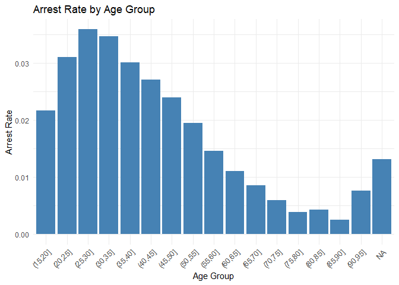
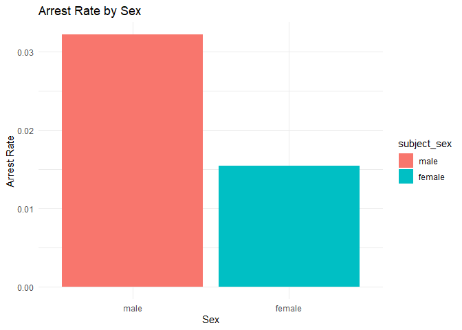
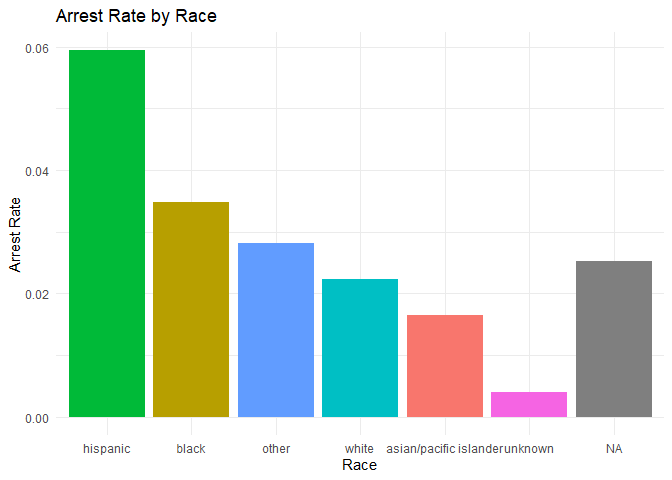

Massachusetts Highway Stops
================
(Your name here)
2020-

- [Grading Rubric](#grading-rubric)
  - [Individual](#individual)
  - [Submission](#submission)
- [Setup](#setup)
  - [**q1** Go to the Stanford Open Policing Project page and download
    the Massachusetts State Police records in `Rds` format. Move the
    data to your `data` folder and match the `filename` to load the
    data.](#q1-go-to-the-stanford-open-policing-project-page-and-download-the-massachusetts-state-police-records-in-rds-format-move-the-data-to-your-data-folder-and-match-the-filename-to-load-the-data)
- [EDA](#eda)
  - [**q2** Do your “first checks” on the dataset. What are the basic
    facts about this
    dataset?](#q2-do-your-first-checks-on-the-dataset-what-are-the-basic-facts-about-this-dataset)
  - [**q3** Check the set of factor levels for `subject_race` and
    `raw_Race`. What do you note about overlap / difference between the
    two
    sets?](#q3-check-the-set-of-factor-levels-for-subject_race-and-raw_race-what-do-you-note-about-overlap--difference-between-the-two-sets)
  - [**q4** Check whether `subject_race` and `raw_Race` match for a
    large fraction of cases. Which of the two hypotheses above is most
    likely, based on your
    results?](#q4-check-whether-subject_race-and-raw_race-match-for-a-large-fraction-of-cases-which-of-the-two-hypotheses-above-is-most-likely-based-on-your-results)
  - [Vis](#vis)
    - [**q5** Compare the *arrest rate*—the fraction of total cases in
      which the subject was arrested—across different factors. Create as
      many visuals (or tables) as you need, but make sure to check the
      trends across all of the `subject` variables. Answer the questions
      under *observations*
      below.](#q5-compare-the-arrest-ratethe-fraction-of-total-cases-in-which-the-subject-was-arrestedacross-different-factors-create-as-many-visuals-or-tables-as-you-need-but-make-sure-to-check-the-trends-across-all-of-the-subject-variables-answer-the-questions-under-observations-below)
- [Modeling](#modeling)
  - [**q6** Run the following code and interpret the regression
    coefficients. Answer the questions under *observations*
    below.](#q6-run-the-following-code-and-interpret-the-regression-coefficients-answer-the-questions-under-observations-below)
  - [**q7** Re-fit the logistic regression from q6 setting `"white"` as
    the reference level for `subject_race`. Interpret the the model
    terms and answer the questions
    below.](#q7-re-fit-the-logistic-regression-from-q6-setting-white-as-the-reference-level-for-subject_race-interpret-the-the-model-terms-and-answer-the-questions-below)
  - [**q8** Re-fit the model using a factor indicating the presence of
    contraband in the subject’s vehicle. Answer the questions under
    *observations*
    below.](#q8-re-fit-the-model-using-a-factor-indicating-the-presence-of-contraband-in-the-subjects-vehicle-answer-the-questions-under-observations-below)
  - [**q9** Go deeper: Pose at least one more question about the data
    and fit at least one more model in support of answering that
    question.](#q9-go-deeper-pose-at-least-one-more-question-about-the-data-and-fit-at-least-one-more-model-in-support-of-answering-that-question)
  - [Further Reading](#further-reading)

*Purpose*: In this last challenge we’ll focus on using logistic
regression to study a large, complicated dataset. Interpreting the
results of a model can be challenging—both in terms of the statistics
and the real-world reasoning—so we’ll get some practice in this
challenge.

<!-- include-rubric -->

# Grading Rubric

<!-- -------------------------------------------------- -->

Unlike exercises, **challenges will be graded**. The following rubrics
define how you will be graded, both on an individual and team basis.

## Individual

<!-- ------------------------- -->

| Category | Needs Improvement | Satisfactory |
|----|----|----|
| Effort | Some task **q**’s left unattempted | All task **q**’s attempted |
| Observed | Did not document observations, or observations incorrect | Documented correct observations based on analysis |
| Supported | Some observations not clearly supported by analysis | All observations clearly supported by analysis (table, graph, etc.) |
| Assessed | Observations include claims not supported by the data, or reflect a level of certainty not warranted by the data | Observations are appropriately qualified by the quality & relevance of the data and (in)conclusiveness of the support |
| Specified | Uses the phrase “more data are necessary” without clarification | Any statement that “more data are necessary” specifies which *specific* data are needed to answer what *specific* question |
| Code Styled | Violations of the [style guide](https://style.tidyverse.org/) hinder readability | Code sufficiently close to the [style guide](https://style.tidyverse.org/) |

## Submission

<!-- ------------------------- -->

Make sure to commit both the challenge report (`report.md` file) and
supporting files (`report_files/` folder) when you are done! Then submit
a link to Canvas. **Your Challenge submission is not complete without
all files uploaded to GitHub.**

*Background*: We’ll study data from the [Stanford Open Policing
Project](https://openpolicing.stanford.edu/data/), specifically their
dataset on Massachusetts State Patrol police stops.

``` r
library(broom)
library(tidyverse)
```

    ## ── Attaching core tidyverse packages ──────────────────────── tidyverse 2.0.0 ──
    ## ✔ dplyr     1.1.4     ✔ readr     2.1.5
    ## ✔ forcats   1.0.0     ✔ stringr   1.5.1
    ## ✔ ggplot2   3.5.1     ✔ tibble    3.2.1
    ## ✔ lubridate 1.9.4     ✔ tidyr     1.3.1
    ## ✔ purrr     1.0.2     
    ## ── Conflicts ────────────────────────────────────────── tidyverse_conflicts() ──
    ## ✖ dplyr::filter() masks stats::filter()
    ## ✖ dplyr::lag()    masks stats::lag()
    ## ℹ Use the conflicted package (<http://conflicted.r-lib.org/>) to force all conflicts to become errors

# Setup

<!-- -------------------------------------------------- -->

### **q1** Go to the [Stanford Open Policing Project](https://openpolicing.stanford.edu/data/) page and download the Massachusetts State Police records in `Rds` format. Move the data to your `data` folder and match the `filename` to load the data.

*Note*: An `Rds` file is an R-specific file format. The function
`readRDS` will read these files.

``` r
## TODO: Download the data, move to your data folder, and load it
filename <- "./data/yg821jf8611_ma_statewide_2020_04_01.rds"
df_data <- readRDS(filename)
glimpse(df_data)
```

    ## Rows: 3,416,238
    ## Columns: 24
    ## $ raw_row_number             <chr> "1", "2", "3", "4", "5", "6", "7", "8", "9"…
    ## $ date                       <date> 2007-06-06, 2007-06-07, 2007-06-07, 2007-0…
    ## $ location                   <chr> "MIDDLEBOROUGH", "SEEKONK", "MEDFORD", "MED…
    ## $ county_name                <chr> "Plymouth County", "Bristol County", "Middl…
    ## $ subject_age                <int> 33, 36, 56, 37, 22, 34, 54, 31, 21, 56, 56,…
    ## $ subject_race               <fct> white, white, white, white, hispanic, white…
    ## $ subject_sex                <fct> male, male, female, male, female, male, mal…
    ## $ type                       <fct> vehicular, vehicular, vehicular, vehicular,…
    ## $ arrest_made                <lgl> FALSE, FALSE, FALSE, FALSE, FALSE, FALSE, F…
    ## $ citation_issued            <lgl> TRUE, FALSE, FALSE, FALSE, TRUE, TRUE, TRUE…
    ## $ warning_issued             <lgl> FALSE, TRUE, TRUE, TRUE, FALSE, FALSE, FALS…
    ## $ outcome                    <fct> citation, warning, warning, warning, citati…
    ## $ contraband_found           <lgl> NA, FALSE, NA, NA, NA, NA, NA, NA, NA, NA, …
    ## $ contraband_drugs           <lgl> NA, FALSE, NA, NA, NA, NA, NA, NA, NA, NA, …
    ## $ contraband_weapons         <lgl> NA, FALSE, NA, NA, NA, NA, NA, NA, NA, NA, …
    ## $ contraband_alcohol         <lgl> FALSE, FALSE, FALSE, FALSE, FALSE, FALSE, F…
    ## $ contraband_other           <lgl> NA, FALSE, NA, NA, NA, NA, NA, NA, NA, NA, …
    ## $ frisk_performed            <lgl> NA, FALSE, NA, NA, NA, NA, NA, NA, NA, NA, …
    ## $ search_conducted           <lgl> FALSE, TRUE, FALSE, FALSE, FALSE, FALSE, FA…
    ## $ search_basis               <fct> NA, other, NA, NA, NA, NA, NA, NA, NA, NA, …
    ## $ reason_for_stop            <chr> "Speed", NA, NA, NA, NA, "Speed", NA, NA, N…
    ## $ vehicle_type               <chr> "Passenger", "Commercial", "Passenger", "Co…
    ## $ vehicle_registration_state <fct> MA, MA, MA, MA, MA, MA, MA, MA, MA, MA, MA,…
    ## $ raw_Race                   <chr> "White", "White", "White", "White", "Hispan…

# EDA

<!-- -------------------------------------------------- -->

### **q2** Do your “first checks” on the dataset. What are the basic facts about this dataset?

``` r
summary(df_data)
```

    ##  raw_row_number          date              location         county_name       
    ##  Length:3416238     Min.   :2007-01-01   Length:3416238     Length:3416238    
    ##  Class :character   1st Qu.:2009-04-22   Class :character   Class :character  
    ##  Mode  :character   Median :2011-07-08   Mode  :character   Mode  :character  
    ##                     Mean   :2011-07-16                                        
    ##                     3rd Qu.:2013-08-27                                        
    ##                     Max.   :2015-12-31                                        
    ##                                                                               
    ##   subject_age                     subject_race     subject_sex     
    ##  Min.   :10.00    asian/pacific islander: 166842   male  :2362238  
    ##  1st Qu.:25.00    black                 : 351610   female:1038377  
    ##  Median :34.00    hispanic              : 338317   NA's  :  15623  
    ##  Mean   :36.47    white                 :2529780                   
    ##  3rd Qu.:46.00    other                 :  11008                   
    ##  Max.   :94.00    unknown               :  17017                   
    ##  NA's   :158006   NA's                  :   1664                   
    ##          type         arrest_made     citation_issued warning_issued 
    ##  pedestrian:      0   Mode :logical   Mode :logical   Mode :logical  
    ##  vehicular :3416238   FALSE:3323303   FALSE:1244039   FALSE:2269244  
    ##                       TRUE :92019     TRUE :2171283   TRUE :1146078  
    ##                       NA's :916       NA's :916       NA's :916      
    ##                                                                      
    ##                                                                      
    ##                                                                      
    ##      outcome        contraband_found contraband_drugs contraband_weapons
    ##  warning :1146078   Mode :logical    Mode :logical    Mode :logical     
    ##  citation:2171283   FALSE:28256      FALSE:36296      FALSE:53237       
    ##  summons :      0   TRUE :27474      TRUE :19434      TRUE :2493        
    ##  arrest  :  92019   NA's :3360508    NA's :3360508    NA's :3360508     
    ##  NA's    :   6858                                                       
    ##                                                                         
    ##                                                                         
    ##  contraband_alcohol contraband_other frisk_performed search_conducted
    ##  Mode :logical      Mode :logical    Mode :logical   Mode :logical   
    ##  FALSE:3400070      FALSE:51708      FALSE:51029     FALSE:3360508   
    ##  TRUE :16168        TRUE :4022       TRUE :3602      TRUE :55730     
    ##                     NA's :3360508    NA's :3361607                   
    ##                                                                      
    ##                                                                      
    ##                                                                      
    ##          search_basis     reason_for_stop    vehicle_type      
    ##  k9            :      0   Length:3416238     Length:3416238    
    ##  plain view    :      0   Class :character   Class :character  
    ##  consent       :   6903   Mode  :character   Mode  :character  
    ##  probable cause:  25898                                        
    ##  other         :  18228                                        
    ##  NA's          :3365209                                        
    ##                                                                
    ##  vehicle_registration_state   raw_Race        
    ##  MA     :3053713            Length:3416238    
    ##  CT     :  82906            Class :character  
    ##  NY     :  69059            Mode  :character  
    ##  NH     :  51514                              
    ##  RI     :  39375                              
    ##  (Other): 109857                              
    ##  NA's   :   9814

**Observations**:

- What are the basic facts about this dataset?
- 19 variables
- We have a lot of data about individuals here - we have access to their
  race, outcome of the stop, the type of car they were driving, if they
  had any contriband, their sex, and more
- most of these vehicles have massachusetts license places, but there
  are also a considerable amount from out of state
- there were no police stops performed on pedestrians

Note that we have both a `subject_race` and `race_Raw` column. There are
a few possibilities as to what `race_Raw` represents:

- `race_Raw` could be the race of the police officer in the stop
- `race_Raw` could be an unprocessed version of `subject_race`

Let’s try to distinguish between these two possibilities.

### **q3** Check the set of factor levels for `subject_race` and `raw_Race`. What do you note about overlap / difference between the two sets?

``` r
## TODO: Determine the factor levels for subject_race and raw_Race
df_data %>% 
  pull(subject_race) %>% 
  unique()
```

    ## [1] white                  hispanic               black                 
    ## [4] asian/pacific islander other                  <NA>                  
    ## [7] unknown               
    ## Levels: asian/pacific islander black hispanic white other unknown

``` r
df_data %>% 
  pull(raw_Race) %>% 
  unique()
```

    ## [1] "White"                                        
    ## [2] "Hispanic"                                     
    ## [3] "Black"                                        
    ## [4] "Asian or Pacific Islander"                    
    ## [5] "Middle Eastern or East Indian (South Asian)"  
    ## [6] "American Indian or Alaskan Native"            
    ## [7] NA                                             
    ## [8] "None - for no operator present citations only"
    ## [9] "A"

**Observations**:

- What are the unique values for `subject_race`?
  - white, hispanic, black, asian/pacific islander, other, and \<NA\>
- What are the unique values for `raw_Race`?
  - White, Hispanic, Black, Asian or Pacific Islander, Middle Eastern or
    East Indian (South Asian), American Indian or Alaskan Native, NA,
    None - for no operator present citations only, and A
- What is the overlap between the two sets?
  - all of ones that exist in subject_race exist in raw_Race, just
    capitalized, so the overlap is the entirety of subject_race
- What is the difference between the two sets?
  - but, there are a bunch of interesting ones in the raw_Race column
    that don’t exist in subject_race - new ones for middle eastern and
    native folks, along with some contextual ones like NA and basically
    “there was no one in the car”, along with the mysterious “A”

### **q4** Check whether `subject_race` and `raw_Race` match for a large fraction of cases. Which of the two hypotheses above is most likely, based on your results?

*Note*: Just to be clear, I’m *not* asking you to do a *statistical*
hypothesis test.

``` r
## TODO: Devise your own way to test the hypothesis posed above.
wrongs <- df_data %>%
  mutate(match = tolower(subject_race) == tolower(raw_Race)) %>%
  filter(!match) %>%
  mutate(words = subject_race == "asian/pacific islander" & raw_Race == "Asian or Pacific Islander") %>% 
  filter(!words) %>% 
  select(subject_race, raw_Race)
glimpse(wrongs)
```

    ## Rows: 92,575
    ## Columns: 2
    ## $ subject_race <fct> asian/pacific islander, other, asian/pacific islander, ot…
    ## $ raw_Race     <chr> "Middle Eastern or East Indian (South Asian)", "American …

**Observations**

Between the two hypotheses:

- `race_Raw` could be the race of the police officer in the stop
- `race_Raw` could be an unprocessed version of `subject_race`

which is most plausible, based on your results?

- i’m guessing race Raw is an unprocessed version of subject race - it
  seems like raw_Race is just a more specific version - there’s ~92000
  mismatches, and they’re basically all just when the raw is more
  specific with middle eastern and subject brings it to just asian and
  similar behaviors

## Vis

<!-- ------------------------- -->

### **q5** Compare the *arrest rate*—the fraction of total cases in which the subject was arrested—across different factors. Create as many visuals (or tables) as you need, but make sure to check the trends across all of the `subject` variables. Answer the questions under *observations* below.

(Note: Create as many chunks and visuals as you need)

``` r
df_arrest <- df_data %>%
  filter(!is.na(arrest_made)) %>% 
  mutate(arrested = as.numeric(arrest_made))

age_plot <- df_arrest %>%
  mutate(age_bin = cut(subject_age, breaks = seq(15, 100, by = 5))) %>%
  group_by(age_bin) %>%
  summarise(arrest_rate = mean(arrested, na.rm = TRUE)) %>%
  ggplot(aes(x = age_bin, y = arrest_rate)) +
  geom_col(fill = "steelblue") +
  labs(
    title = "Arrest Rate by Age Group",
    x = "Age Group",
    y = "Arrest Rate"
  ) +
  theme_minimal() +
  theme(axis.text.x = element_text(angle = 45, hjust = 1))
```

``` r
sex_plot <- df_arrest %>%
  filter(subject_sex %in% c("male", "female")) %>%
  group_by(subject_sex) %>%
  summarise(arrest_rate = mean(arrested, na.rm = TRUE)) %>%
  ggplot(aes(x = subject_sex, y = arrest_rate, fill = subject_sex)) +
  geom_col() +
  labs(
    title = "Arrest Rate by Sex",
    x = "Sex",
    y = "Arrest Rate"
  ) +
  theme_minimal()
```

``` r
race_plot <- df_arrest %>%
  group_by(subject_race) %>%
  summarise(arrest_rate = mean(arrested, na.rm = TRUE)) %>%
  ggplot(aes(x = reorder(subject_race, -arrest_rate), y = arrest_rate, fill = subject_race)) +
  geom_col() +
  labs(
    title = "Arrest Rate by Race",
    x = "Race",
    y = "Arrest Rate"
  ) +
  theme_minimal() +
  theme(legend.position = "none")
```

``` r
age_plot
```

<!-- -->

``` r
sex_plot
```

<!-- -->

``` r
race_plot
```

<!-- -->

**Observations**:

- How does `arrest_rate` tend to vary with `subject_age`?
  - most very young people (15-20) tend to get let off the hook more
    often than their slightly older counter parts (20-50).
  - within that 20-50 range, there is a sort of bell curve with slight
    right skew phenomenon with the rate - 25-30 is the range with the
    highest proportion.
  - after the 50 number, it really begins to tail off, making this very
    highly right skewed
  - surprisingly, there is a significant jump in the 90-95 range - what
    are *they* in for?
  - the NA category has a not insignifant proportion, but definitely
    less than the young peoples.
- How does `arrest_rate` tend to vary with `subject_sex`?
  - men have a higher proportion of arrests arising from police stops
    than women do
- How does `arrest_rate` tend to vary with `subject_race`?
  - hispanic people have the highest proportion of stops leading to
    arrests by a very large margin, and then black people, then white
    people, and then asian people/pacific islanders.
  - less than all of those though, the NA category
    - one potential explanation could possibly be that the NA category
      suggested that data was not collected, so it was over quite
      quickly bc an arrest was not made, but this is not shown in the
      visualization and is purely conjecture

# Modeling

<!-- -------------------------------------------------- -->

We’re going to use a model to study the relationship between `subject`
factors and arrest rate, but first we need to understand a bit more
about *dummy variables*

### **q6** Run the following code and interpret the regression coefficients. Answer the questions under *observations* below.

``` r
## NOTE: No need to edit; inspect the estimated model terms.
fit_q6 <-
  glm(
    formula = arrest_made ~ subject_age + subject_race + subject_sex,
    data = df_data %>%
      filter(
        !is.na(arrest_made),
        subject_race %in% c("white", "black", "hispanic")
      ),
    family = "binomial"
  )

fit_q6 %>% tidy()
```

    ## # A tibble: 5 × 5
    ##   term                 estimate std.error statistic   p.value
    ##   <chr>                   <dbl>     <dbl>     <dbl>     <dbl>
    ## 1 (Intercept)           -2.67    0.0132      -202.  0        
    ## 2 subject_age           -0.0142  0.000280     -50.5 0        
    ## 3 subject_racehispanic   0.513   0.0119        43.3 0        
    ## 4 subject_racewhite     -0.380   0.0103       -37.0 3.12e-299
    ## 5 subject_sexfemale     -0.755   0.00910      -83.0 0

**Observations**:

- Which `subject_race` levels are included in fitting the model?
  - the hispanic and white levels
- Which `subject_race` levels have terms in the model?
  - the female level

You should find that each factor in the model has a level *missing* in
its set of terms. This is because R represents factors against a
*reference level*: The model treats one factor level as “default”, and
each factor model term represents a change from that “default” behavior.
For instance, the model above treats `subject_sex==male` as the
reference level, so the `subject_sexfemale` term represents the *change
in probability* of arrest due to a person being female (rather than
male).

The this reference level approach to coding factors is necessary for
[technical
reasons](https://www.andrew.cmu.edu/user/achoulde/94842/lectures/lecture10/lecture10-94842.html#why-is-one-of-the-levels-missing-in-the-regression),
but it complicates interpreting the model results. For instance; if we
want to compare two levels, neither of which are the reference level, we
have to consider the difference in their model coefficients. But if we
want to compare all levels against one “baseline” level, then we can
relevel the data to facilitate this comparison.

By default `glm` uses the first factor level present as the reference
level. Therefore we can use
`mutate(factor = fct_relevel(factor, "desired_level"))` to set our
`"desired_level"` as the reference factor.

### **q7** Re-fit the logistic regression from q6 setting `"white"` as the reference level for `subject_race`. Interpret the the model terms and answer the questions below.

``` r
## TODO: Re-fit the logistic regression, but set "white" as the reference
## level for subject_race
df_white_first <- df_data
  

fit_q6 <-
  glm(
    formula = arrest_made ~ subject_age + subject_race + subject_sex,
    data = df_data %>%
      filter(
        !is.na(arrest_made),
        subject_race %in% c("white", "black", "hispanic")
      ) %>% 
      mutate(subject_race = fct_relevel(subject_race, "white")),
    family = "binomial"
  )

fit_q6 %>% tidy()
```

    ## # A tibble: 5 × 5
    ##   term                 estimate std.error statistic   p.value
    ##   <chr>                   <dbl>     <dbl>     <dbl>     <dbl>
    ## 1 (Intercept)           -3.05    0.0109      -279.  0        
    ## 2 subject_age           -0.0142  0.000280     -50.5 0        
    ## 3 subject_raceblack      0.380   0.0103        37.0 3.12e-299
    ## 4 subject_racehispanic   0.893   0.00859      104.  0        
    ## 5 subject_sexfemale     -0.755   0.00910      -83.0 0

**Observations**:

- Which `subject_race` level has the highest probability of being
  arrested, according to this model? Which has the lowest probability?
  - Hispanic people have the highest probability, and white people have
    the lowest
- What could explain this difference in probabilities of arrest across
  race? List **multiple** possibilities.
  - internalized racism by cops
  - white people growing up not being scared of cops and knowing exactly
    how to interact with them
  - hispanic and black people through systematic oppression being more
    likely to turn to contraband methods of economic security
- Look at the set of variables in the dataset; do any of the columns
  relate to a potential explanation you listed?
  - the third point could be looked at with the relationship between
    race and contraband

One way we can explain differential arrest rates is to include some
measure indicating the presence of an arrestable offense. We’ll do this
in a particular way in the next task.

### **q8** Re-fit the model using a factor indicating the presence of contraband in the subject’s vehicle. Answer the questions under *observations* below.

``` r
## TODO: Repeat the modeling above, but control for whether contraband was found
## during the police stop
df_factored <- df_data %>% 
  mutate(contraband_found = factor(contraband_found, levels = c(TRUE, FALSE)))

fit_q8 <-
  glm(
    formula = arrest_made ~ subject_age + subject_race + subject_sex + contraband_found,
    data = df_factored %>%
      filter(
        !is.na(arrest_made),
        subject_race %in% c("white", "black", "hispanic")
      ),
    family = "binomial"
  )

fit_q8 %>% tidy()
```

    ## # A tibble: 6 × 5
    ##   term                  estimate std.error statistic   p.value
    ##   <chr>                    <dbl>     <dbl>     <dbl>     <dbl>
    ## 1 (Intercept)            -1.16    0.0359      -32.4  2.16e-230
    ## 2 subject_age             0.0225  0.000866     26.0  2.19e-149
    ## 3 subject_racehispanic    0.272   0.0315        8.62 6.99e- 18
    ## 4 subject_racewhite       0.0511  0.0270        1.90 5.80e-  2
    ## 5 subject_sexfemale      -0.306   0.0257      -11.9  1.06e- 32
    ## 6 contraband_foundFALSE  -0.609   0.0192      -31.7  4.29e-221

**Observations**:

- How does controlling for found contraband affect the `subject_race`
  terms in the model?
  - it shows foremost that your probably of having been part of the
    arrested part of this data set is wayyyyy higher if you had
    contraband
  - it also switches up the narrative around some of the other
    variables - now, for example, the numbers relate to the probability
    of, say, you had contraband and you were white or you had contraband
    and you were hispanic or whatever…
    - there is now a new default which is that the person had contraband
- What does the *finding of contraband* tell us about the stop? What
  does it *not* tell us about the stop?
  - the find of contraband tells us that there is a much higher
    probability of this person having been arrested - it does not
    specifically relate to any of the other quantities, so it does not
    tell us the likelihood of this person having been a certain race or
    sex or age

### **q9** Go deeper: Pose at least one more question about the data and fit at least one more model in support of answering that question.

``` r
df_search <- df_data %>% 
  filter(!is.na(search_basis)) %>%
  pull(search_basis)

glimpse(df_search)
```

    ##  Factor w/ 5 levels "k9","plain view",..: 5 5 5 5 5 5 5 5 5 5 ...

``` r
df_probable <- df_data %>%
  filter(
    !is.na(search_basis),
    subject_race %in% c("white", "black", "hispanic")
  ) %>%
  mutate(
    probable_cause = search_basis == "probable cause",
    subject_race = fct_relevel(subject_race, "white") # Set white as reference
  )

fit_q9 <-
  glm(
    formula = probable_cause ~ subject_race,
    data = df_probable,
    family = "binomial"
  )

fit_q9 %>% tidy()
```

    ## # A tibble: 3 × 5
    ##   term                 estimate std.error statistic      p.value
    ##   <chr>                   <dbl>     <dbl>     <dbl>        <dbl>
    ## 1 (Intercept)            0.0379    0.0113      3.36 0.000793    
    ## 2 subject_raceblack      0.142     0.0254      5.58 0.0000000241
    ## 3 subject_racehispanic  -0.131     0.0229     -5.72 0.0000000108

**Observations**:

The question I wanted to answer is whether the estimate was higher or
lower for black and hispanic people (compared to white people) for
having been stopped for “probable cause.” probable cause seemed like
sort of dubious wording, so I wanted to see if it was being used to
justify systematic racism within policing.

- from this model, it seems that black people within this dataset are
  more likely to have searched for probable cause and hispanic people
  less so.

- both of these come with a p-value in the scale of 10^-8, which lends
  itself to the assumption that these results may be significant.

- it is interesting that hispanic people are less likely to have been
  stopped for probable cause - this in the context of hispanic people
  being the most likely to have been arrested is interesting

  - possibly, but notably conjecturing, is this linked because more
    severe crimes are more likely to be noticed, which would lend itself
    to the other reasons like K9 and plain view. or possibly is this
    because there was no pity after the reason was not consent? who
    knows? this data does not lend itself to answering these questions

## Further Reading

<!-- -------------------------------------------------- -->

- Stanford Open Policing Project
  [findings](https://openpolicing.stanford.edu/findings/).
