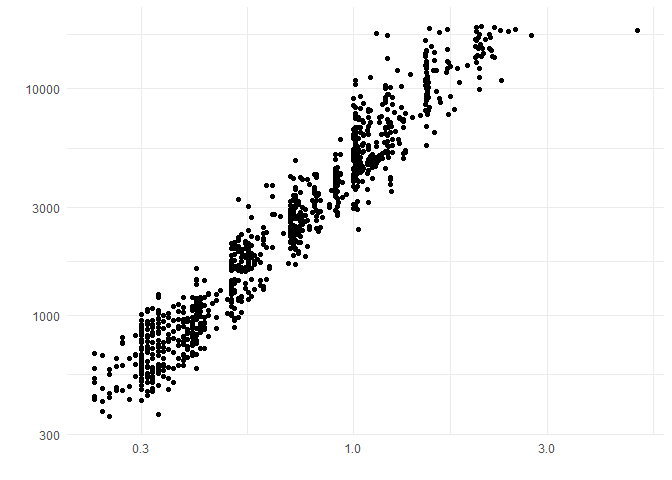
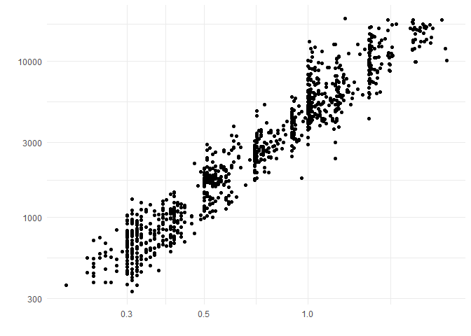

Communication: Active and Constructive Responding
================
Zach del Rosario
2020-08-14

# Communication: Active and Constructive Responding

*Purpose*: We’re going to spend **a lot** of time in this class
discussing datasets. To help prepare ourselves for productive
discussions, we’re going to use some ideas from [positive
psychology](https://en.wikipedia.org/wiki/Positive_psychology) to help
make our discussions more pleasant and productive.

*Reading*: [GoStrengths: What is Active and Constructive
Responding?](https://gostrengths.com/what-is-active-and-constructive-responding/)

*Reading Time*: ~ 10 minutes

``` r
library(tidyverse)
```

    ## ── Attaching core tidyverse packages ──────────────────────── tidyverse 2.0.0 ──
    ## ✔ dplyr     1.1.4     ✔ readr     2.1.5
    ## ✔ forcats   1.0.0     ✔ stringr   1.5.1
    ## ✔ ggplot2   3.5.1     ✔ tibble    3.2.1
    ## ✔ lubridate 1.9.4     ✔ tidyr     1.3.1
    ## ✔ purrr     1.0.2     
    ## ── Conflicts ────────────────────────────────────────── tidyverse_conflicts() ──
    ## ✖ dplyr::filter() masks stats::filter()
    ## ✖ dplyr::lag()    masks stats::lag()
    ## ℹ Use the conflicted package (<http://conflicted.r-lib.org/>) to force all conflicts to become errors

## Review: Active and Constructive Responding (ACR)

<!-- -------------------------------------------------- -->

The reading introduces the idea of *active and constructive responding*
(ACR) to *good news*. The following table summarizes the four primary
ways of responding to someone when presented with good news:

|              | Active | Passive      |
|--------------|--------|--------------|
| Constructive | Good!  | Bad          |
| Destructive  | Bad    | Danger zone! |

We’ll call this the *active-passive-constructive-destructive* (APCD)
framework.

For example, if your friend tells you “Hey, I just got an A on my
exam!”, you could respond in a number of different ways:

- “That’s terrific! I remember you were studying really hard. What do
  you want to do to celebrate?” (*Active and Constructive*)
  - This is *active* in the sense that it responds to and builds upon
    the substance of your friend’s statement.
  - This is *constructive* in that it conveys positive emotion.
  - (This is the best way you can respond to good news \[1\]!)
- “Oh that’s cool, I guess.” (*Passive and Constructive*)
  - This is *constructive* in that it conveys positive emotion.
  - However this is *passive* in that it does not actively engage with
    your friend’s statement.
- “But the professor was grading on a curve! Gah, that means I probably
  didn’t get an A.” (*Active and Destructive*)
  - This is *active* in the sense that it responds to and builds upon
    the substance of your friend’s statement.
  - However this is *destructive* in that it conveys a negative reaction
    to your friend’s statement.
- “Dude whatever. I got an internship!” *Passive and Destructive*:
  - However this is *passive* in that it does not actively engage with
    your friend’s statement.
  - This is also *destructive* in that it implicitly conveys a negative
    reaction by ignoring the substance of your friend’s statement.
  - (This is the worst way you can respond to good news!)

Active and constructive responding (ACR) has been shown to be associated
with more positive interpersonal relationships \[1\]. If you want want
to have better platonic or romantic relationships, you sould practice
ACR!

## Having Productive Discussions

<!-- -------------------------------------------------- -->

What does ACR have to do with data science? Imagine you’re in a meeting
with some data science colleagues, and the presenter shows the following
graph.

``` r
## NOTE: No need to edit; just run and inspect
diamonds %>%
  slice_sample(n = 1000) %>%

  ggplot(aes(carat, price)) +
  geom_point() +

  scale_x_log10() +
  scale_y_log10() +
  theme_minimal() +
  labs(x = "", y = "")
```

<!-- -->

Let’s use the active-passive-constructive-destructive (APCD) response
framework above to analyze some *discussion scenarios*. Imagine the
following scenario:

> *Presenter*: “Clearly, we can see a positive correlation between price
> and carat.”
>
> *Colleague*: “Um, what are the axes here?”
>
> *Presenter*: **“Obviously the graph shows price vs carat. On the next
> slide…”**

Here the bolded response is *actively* engaging with your colleague’s
question, but is doing so in a very *destructive* way. It’s likely your
colleague feels hurt, and is less likely now to speak up in meetings.
That’s a bad thing!

### **q1** Identify the nature of the bolded line below, rating it as either **active vs passive** and **constructive vs destructive**.

> *Presenter*: “Clearly, we can see a positive correlation between price
> and carat.”
>
> *Colleague*: “Um, what are the axes here?”
>
> *Presenter*: **“Woah good catch there, they’re unlabeled. The vertical
> shows price, and the horizontal shows carat.”**

**Observations**:

- Is the bolded response **active** or **passive**? Why?
  - active - engages with the question, responds to it well
- Is the bolded response **constructive** or **destructive**? Why?
  - constructive, is appreciative of the fact that they caught something
    and doesn’t dismiss them
- How does this statement make you *feel*, relative to the bolded
  statement before the q1 prompt?

### **q2** Identify the nature of the bolded line below, rating it as either **active vs passive** and **constructive vs destructive**.

> *Presenter*: “Clearly, we can see a positive correlation between price
> and carat.”
>
> *Colleague*: “Um, what are the axes here?”
>
> *Presenter*: **“Woah good catch there, they’re unlabeled. Moving
> on….”**

**Observations**:

- Is the bolded response **active** or **passive**? Why?
  - active - it responds to it and tells them that they’re unlabeled
- Is the bolded response **constructive** or **destructive**? Why?
  - but… it is destructive in that it intentionally dismisses their
    point and belittles them
- How does this statement make you *feel*, relative to the bolded
  statement before the q1 prompt?
  - its very dismissive, I don’t like the way it makes me feel

**Intermediate Conclusion**: We can quite naturally think of discussion
responses in the APCD framework. Therefore, we should try to give active
and constructive responses in data discussions!

## Active and Constructive Questions

<!-- ------------------------- -->

With a bit of imagination, we can apply the APCD framework to
*questions* as well. Let’s keep looking at the same graph.

``` r
## NOTE: No need to edit; just run and inspect
diamonds %>%
  slice_sample(n = 1000) %>%

  ggplot(aes(carat, price)) +
  geom_point() +

  scale_x_log10() +
  scale_y_log10() +
  theme_minimal() +
  labs(x = "", y = "")
```

<!-- -->

Imagine the following scenario:

> *Presenter*: “Clearly, we can see a positive correlation between price
> and carat.”
>
> *Colleague*: **“Percival, why are you so terrible at making graphs?”**
>
> *Presenter*: “…”

Here the bolded question is *passively* engaging with the presenter’s
content (it’s not referring to any issues in the graph, but rather
making an *ad hominem* attack of the presenter) and *destructively*
making a value judgment on the presenter. This is a truly horrendous way
to ask a question.

Let’s look at a **far more effective** way to ask a question:

> *Presenter*: “Clearly, we can see a positive correlation between price
> and carat.”
>
> *Colleague*: **“Percival, this is an interesting finding but I’m
> confused by this graph—what do the axes represent?”**
>
> *Presenter*: “Oh, the labels are missing! The vertical shows price,
> and the horizontal shows carat.”

Here the bolded question is *actively* engaging with the presenter’s
content (the colleague makes it clear what the problem with the graph
is) and *constructively* validates the presenter’s findings. This is far
more effective than the question posed above.

As a bonus, this question also illustrates another tip: Making “I”
statements. To see the difference, let’s look at a subtly-different
version of the same question:

> *Presenter*: “Clearly, we can see a positive correlation between price
> and carat.”
>
> *Colleague*: “Percival, this is an interesting finding **but your
> graph is very confusing**—what do the axes represent?”
>
> *Presenter*: “Oh, the labels are missing! The vertical shows price,
> and the horizontal shows carat.”

In this second version the colleague is making a value-judgment about
**the graph itself**; in the first version the colleague is making a
statement **about their own subjective experience**. The second version
is debatable (the presenter may think the graph is clear), but only a
jerk would disagree with a person’s subjective experience.

Let’s practice once more!

### **q3** Identify the nature of the bolded line below, rating it as either **active vs passive** and **constructive vs destructive**.

> *Presenter*: “Clearly, we can see a positive correlation between price
> and carat.”
>
> *Colleague*: **“What is your opinion on the morality of aesthetic
> diamonds?”**
>
> *Presenter*: “Umm….”

**Observations**:

- Is the bolded response **active** or **passive**? Why?
  - passive - no response to the graph at hand
- Is the bolded response **constructive** or **destructive**? Why?
  - its somewhat neutral, but the fact that it sets up the discussion to
    go a way that the presenter didn’t want makes it destructive

<!-- include-exit-ticket -->

# Exit Ticket

<!-- -------------------------------------------------- -->

Once you have completed this exercise, make sure to fill out the **exit
ticket survey**, [linked
here](https://docs.google.com/forms/d/e/1FAIpQLSeuq2LFIwWcm05e8-JU84A3irdEL7JkXhMq5Xtoalib36LFHw/viewform?usp=pp_url&entry.693978880=e-comm01-responding-assignment.Rmd).

## Refrences

<!-- -------------------------------------------------- -->

- \[1\] Gable, S. L., Reis, H. T., Impett, E. A., & Asher, E. R. (2004).
  What do you do when things go right? The intrapersonal and
  interpersonal benefits of sharing positive events. Journal of
  Personality and Social Psychology, 87, 228-245.
